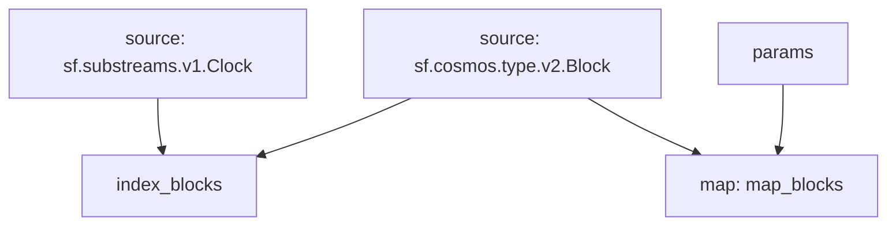

## Cosmos Block Index

### Available query fields

These are the expressions that can be used in queries:

- `type:<type>` - event type
- `attr:<attribute>` - event attribute
- `message:<message>` - message type
- `block.number:<number>` - block number

Queries can include `&&` and `||` logical operands, as well as `(` and `)` parenthesis.

## Graph



## Modules

```bash
Name: index_blocks
Initial block: 0
Kind: index
Input: source: sf.cosmos.type.v2.Block
Input: source: sf.substreams.v1.Clock
Output Type: proto:sf.substreams.index.v1.Keys
Hash: 9705c43fdf1cd5e5abfdc596d7cef70cb8cad9a9

Name: map_blocks
Initial block: 0
Kind: map
Input: params: message:cosmos.gov.v1beta1 || message:cosmos.gov.v1 || type:active_proposal || type:signal_proposal || type:inactive_proposal || type:submit_proposal || block.number:1
Input: source: sf.cosmos.type.v2.Block
Block Filter: (using *index_blocks*): `&{<nil>}`
Output Type: proto:sf.cosmos.type.v2.Block
Hash: 3f23efeff3966c936714ae556408cf310fbf11c1
```
