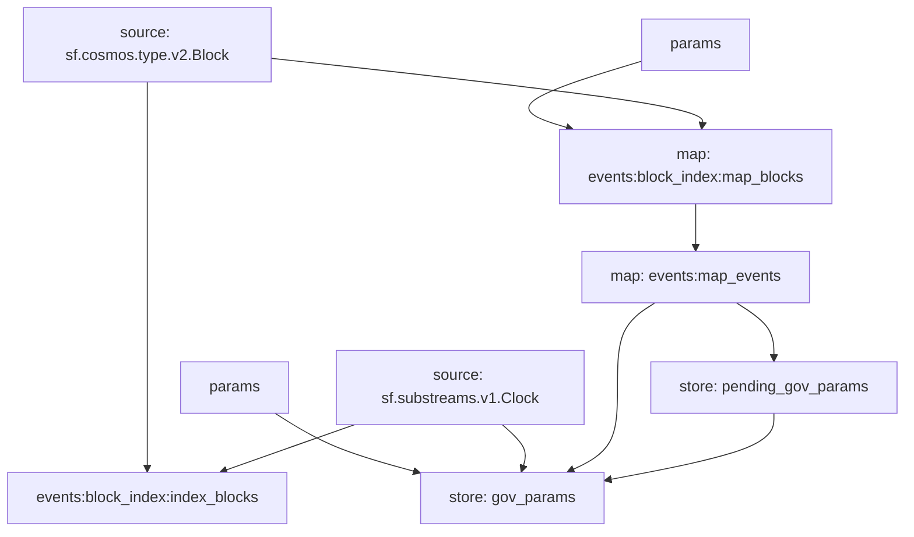

## Cosmos: `Governance Parameters`

> Tracks governance proposals on Cosmos based networks.

## Data Includes

- `GovernanceParameter` stores
  - Active Governance Parameters
  - Pending Governance Parameters

## Graph



## Modules

```yaml
Name: pending_gov_params
Initial block: 0
Kind: store
Input: map: events:map_events
Value Type: string
Update Policy: set
Hash: 0ae11206ce892ca86cde4ca1eb789ec52ec7cb15

Name: gov_params
Initial block: 0
Kind: store
Input: params:
Input: source: sf.substreams.v1.Clock
Input: map: events:map_events
Input: store: pending_gov_params
Value Type: string
Update Policy: set
Hash: 129cbb410dbec84dcd7717edd5eead9893f1feaf

Name: events:map_events
Initial block: 0
Kind: map
Input: map: events:block_index:map_blocks
Output Type: proto:cosmos.proposals.v1.Events
Hash: 376ed13bfeff44669d625914162a50f7435310d2

Name: events:block_index:index_blocks
Initial block: 0
Kind: index
Input: source: sf.cosmos.type.v2.Block
Input: source: sf.substreams.v1.Clock
Output Type: proto:sf.substreams.index.v1.Keys
Hash: a5db3ccc9005164c6805e17ee612a40d17d3dbf9

Name: events:block_index:map_blocks
Initial block: 0
Kind: map
Input: params: message:cosmos.gov.v1beta1 || message:cosmos.gov.v1 || type:active_proposal || type:signal_proposal || type:inactive_proposal || type:submit_proposal || block.number:1
Input: source: sf.cosmos.type.v2.Block
Block Filter: (using *events:block_index:index_blocks*): `&{}`
Output Type: proto:sf.cosmos.type.v2.Block
Hash: cd0139e1363e6b96b692c5731c93e52fcbae43be
```
