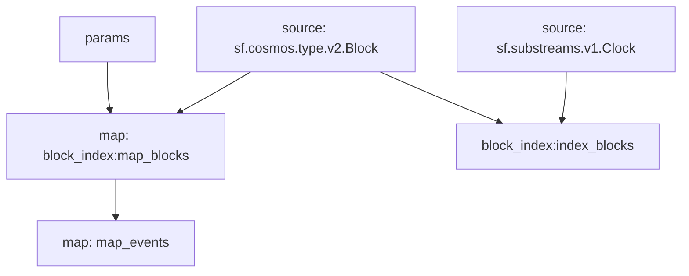

## Cosmos Proposals: `Events`

## Graph



## Modules

```yaml
Name: map_events
Initial block: 0
Kind: map
Input: map: block_index:map_blocks
Output Type: proto:cosmos.proposals.v1.Events
Hash: 6ab77ae51a9336f4ea6e1cae224d26429ffa2707

Name: block_index:index_blocks
Initial block: 0
Kind: index
Input: source: sf.cosmos.type.v2.Block
Input: source: sf.substreams.v1.Clock
Output Type: proto:sf.substreams.index.v1.Keys
Hash: e3e7b11d789f5b03b2633e9cf3ad77bfa4648cb7

Name: block_index:map_blocks
Initial block: 0
Kind: map
Input: params: message:cosmos.gov.v1beta1 || message:cosmos.gov.v1 || type:active_proposal || type:signal_proposal || type:inactive_proposal || type:submit_proposal || block.number:1
Input: source: sf.cosmos.type.v2.Block
Block Filter: (using *block_index:index_blocks*): `&{}`
Output Type: proto:sf.cosmos.type.v2.Block
Hash: 13d5c9b3335ba1018b02c7b8c93f1edb9e1fd85d
```
