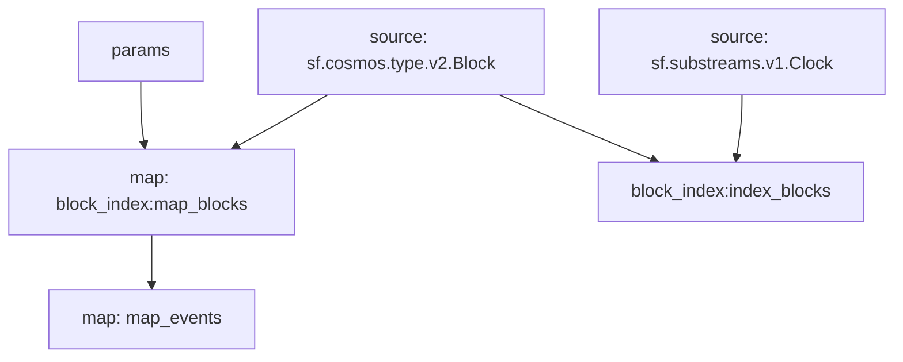

## Cosmos Proposals: `Events`

> Tracks governance proposals on Cosmos based networks.

## Data Includes

- `GovernanceParameter`
  - Governance Params Changes
- `Proposals`
  - Passed Proposal IDs
  - New Proposals with types

## Graph



## Modules

```yaml
Name: map_events
Initial block: 0
Kind: map
Input: map: block_index:map_blocks
Output Type: proto:cosmos.proposals.v1.Events
Hash: 376ed13bfeff44669d625914162a50f7435310d2

Name: block_index:index_blocks
Initial block: 0
Kind: index
Input: source: sf.cosmos.type.v2.Block
Input: source: sf.substreams.v1.Clock
Output Type: proto:sf.substreams.index.v1.Keys
Hash: a5db3ccc9005164c6805e17ee612a40d17d3dbf9

Name: block_index:map_blocks
Initial block: 0
Kind: map
Input: params: message:cosmos.gov.v1beta1 || message:cosmos.gov.v1 || type:active_proposal || type:signal_proposal || type:inactive_proposal || type:submit_proposal || block.number:1
Input: source: sf.cosmos.type.v2.Block
Block Filter: (using *block_index:index_blocks*): `&{}`
Output Type: proto:sf.cosmos.type.v2.Block
Hash: cd0139e1363e6b96b692c5731c93e52fcbae43be
```
