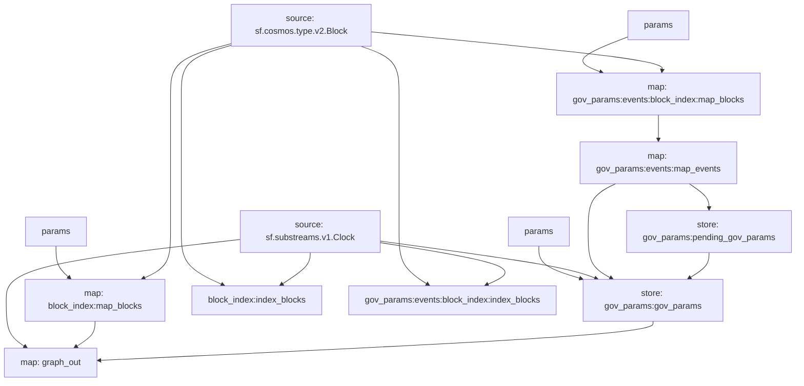

## Cosmos Proposals

## Graph



## Modules

```yaml
Name: graph_out
Initial block: 0
Kind: map
Input: source: sf.substreams.v1.Clock
Input: map: block_index:map_blocks
Input: store: gov_params:gov_params
Output Type: proto:sf.substreams.sink.entity.v1.EntityChanges
Hash: b359a9a10fdbbb2b28fe9dbd6b7167644877fab0

Name: block_index:index_blocks
Initial block: 0
Kind: index
Input: source: sf.cosmos.type.v2.Block
Input: source: sf.substreams.v1.Clock
Output Type: proto:sf.substreams.index.v1.Keys
Hash: e3e7b11d789f5b03b2633e9cf3ad77bfa4648cb7

Name: block_index:map_blocks
Initial block: 0
Kind: map
Input: params: message:cosmos.gov.v1beta1 || message:cosmos.gov.v1 || type:active_proposal || type:signal_proposal || type:inactive_proposal || type:submit_proposal || block.number:1
Input: source: sf.cosmos.type.v2.Block
Block Filter: (using *block_index:index_blocks*): `&{}`
Output Type: proto:sf.cosmos.type.v2.Block
Hash: 13d5c9b3335ba1018b02c7b8c93f1edb9e1fd85d

Name: gov_params:pending_gov_params
Initial block: 0
Kind: store
Input: map: gov_params:events:map_events
Value Type: string
Update Policy: set
Hash: 7eaa5531d6739369be1e81c4b8dd955715ae3513

Name: gov_params:gov_params
Initial block: 0
Kind: store
Input: params: { "deposit_params": { "min_deposit": [{"denom": "uatom", "amount": "512000000"}], "max_deposit_period": "1209600000000000" }, "voting_params": { "voting_period": "1209600000000000" }, "tally_params": { "quorum": "0.400000000000000000", "threshold": "0.500000000000000000", "veto_threshold": "0.334000000000000000" }}
Input: source: sf.substreams.v1.Clock
Input: map: gov_params:events:map_events
Input: store: gov_params:pending_gov_params
Value Type: string
Update Policy: set
Hash: 0e5569117585ca973625422623beb77e0e57a31f

Name: gov_params:events:map_events
Initial block: 0
Kind: map
Input: map: gov_params:events:block_index:map_blocks
Output Type: proto:cosmos.proposals.v1.Events
Hash: 6ab77ae51a9336f4ea6e1cae224d26429ffa2707

Name: gov_params:events:block_index:index_blocks
Initial block: 0
Kind: index
Input: source: sf.cosmos.type.v2.Block
Input: source: sf.substreams.v1.Clock
Output Type: proto:sf.substreams.index.v1.Keys
Hash: e3e7b11d789f5b03b2633e9cf3ad77bfa4648cb7

Name: gov_params:events:block_index:map_blocks
Initial block: 0
Kind: map
Input: params: message:cosmos.gov.v1beta1 || message:cosmos.gov.v1 || type:active_proposal || type:signal_proposal || type:inactive_proposal || type:submit_proposal || block.number:1
Input: source: sf.cosmos.type.v2.Block
Block Filter: (using *gov_params:events:block_index:index_blocks*): `&{}`
Output Type: proto:sf.cosmos.type.v2.Block
Hash: 13d5c9b3335ba1018b02c7b8c93f1edb9e1fd85d
```
